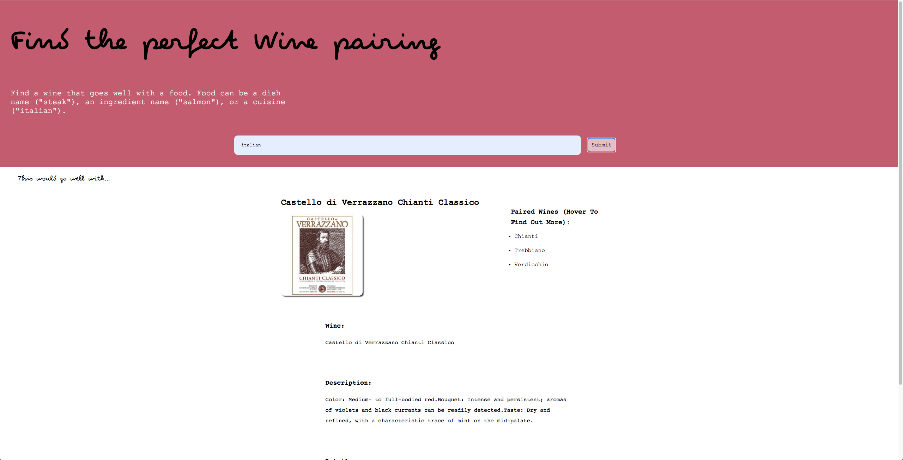
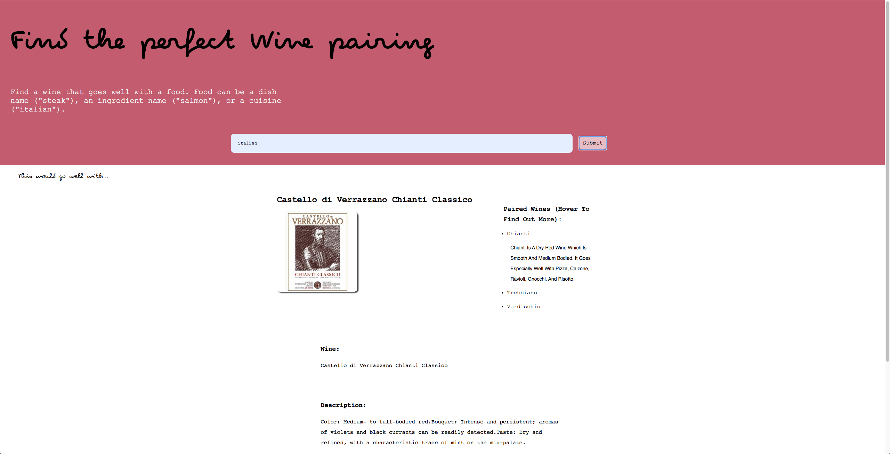

<h1> Wine pair App </h1>

Wine pair.

Demo: https://victorp0.github.io/WinePair/

## Description

Wine pair leverages the spoontacular API to help user find a wine that goes well with a food. Food can be a dish name ("steak"), an ingredient name ("salmon"), or a cuisine ("italian"). Users can also hover over the paired wines to find dishes that goes well with a given wine.

## API Documentation

The Wine pair app uses the spoonacular API (https://spoonacular.com/food-api/docs#Get-Wine-Pairing)

## Technologies used

(HTML5 / CSS / Vanilla JavaScript / jquery)

